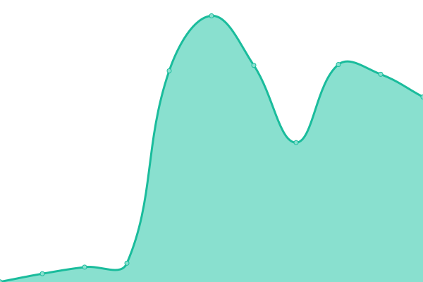
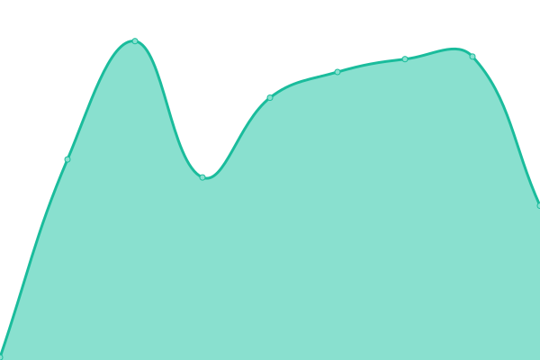
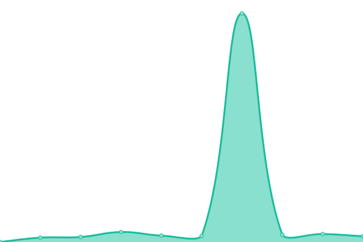

# [📈 Live Status](https://status.ripcdoctor.net): <!--live status--> **🟩 All systems operational**

This repository contains the open-source uptime monitor and status page for [R.I. PC Doctor](https://ripcdoctor.com), powered by [R.I. PC Doctor's status_monitor GitHub repository](https://github.com/ripcdoctor/status_monitor).

You can get your own unlimited and free uptime monitor and status page, powered entirely by a GitHub repository. We use [Issues](https://github.com/ripcdoctor/status_monitor/issues) as incident reports, [Actions](https://github.com/ripcdoctor/status_monitor/actions) as uptime monitors, and [Pages](https://status.ripcdoctor.net) for the status page.

<!--start: status pages-->
<!-- This summary is generated by Upptime (https://github.com/upptime/upptime) -->
<!-- Do not edit this manually, your changes will be overwritten -->
<!-- prettier-ignore -->
| URL | Status | History | Response Time | Uptime |
| --- | ------ | ------- | ------------- | ------ |
|  [Web Hosting Services](https://ripcdoctor.com) | 🟩 Up | [web-hosting-services.yml](https://github.com/ripcdoctor/status_monitor/commits/HEAD/history/web-hosting-services.yml) | 

 86ms
     
 | 

<a href="https://status.ripcdoctor.net/history/web-hosting-services">100.00%</a>
    

|  [Inbound Mail (POP/IMAP)](ssr18.supercp.com) | 🟩 Up | [inbound-mail-pop-imap.yml](https://github.com/ripcdoctor/status_monitor/commits/HEAD/history/inbound-mail-pop-imap.yml) | 

 121ms
     
 | 

<a href="https://status.ripcdoctor.net/history/inbound-mail-pop-imap">100.00%</a>
    

|  [Outbound Mail (SMTP)](ssr18.supercp.com) | 🟩 Up | [outbound-mail-smtp.yml](https://github.com/ripcdoctor/status_monitor/commits/HEAD/history/outbound-mail-smtp.yml) | 

 105ms
     
 | 

<a href="https://status.ripcdoctor.net/history/outbound-mail-smtp">100.00%</a>
    

|  [Hosted DNS](ssr18.supercp.com) | 🟩 Up | [hosted-dns.yml](https://github.com/ripcdoctor/status_monitor/commits/HEAD/history/hosted-dns.yml) | 

 86ms
     
 | 

<a href="https://status.ripcdoctor.net/history/hosted-dns">100.00%</a>
    

|  [Cloud Hosting Services](https://ripcdoctor.cloud) | 🟩 Up | [cloud-hosting-services.yml](https://github.com/ripcdoctor/status_monitor/commits/HEAD/history/cloud-hosting-services.yml) | 

 2974ms
     
 | 

<a href="https://status.ripcdoctor.net/history/cloud-hosting-services">97.55%</a>
    

|  [Short URL Services (ripcdoctor.net/go)](https://ripcdoctor.net/go) | 🟩 Up | [short-url-services-ripcdoctor-net-go.yml](https://github.com/ripcdoctor/status_monitor/commits/HEAD/history/short-url-services-ripcdoctor-net-go.yml) | 

 427ms
     
 | 

<a href="https://status.ripcdoctor.net/history/short-url-services-ripcdoctor-net-go">100.00%</a>
    

|  [VoIP & Unified Call Management Services](https://peterohara.ddns.net:8089) | 🟩 Up | [vo-ip-and-unified-call-management-services.yml](https://github.com/ripcdoctor/status_monitor/commits/HEAD/history/vo-ip-and-unified-call-management-services.yml) | 

 333ms
     
 | 

<a href="https://status.ripcdoctor.net/history/vo-ip-and-unified-call-management-services">100.00%</a>
    

<!--end: status pages-->

[**Visit our status website →**](https://status.ripcdoctor.net)

## 📄 License

- Powered by: [R.I. PC Doctor](https://github.com/ripcdoctor/status_monitor)
- Code: [MIT](./LICENSE) © [Dr. Peter O'Hara-Diaz](https://ripcdoctor.com)
- Data in the `./history` directory: [Open Database License](https://opendatacommons.org/licenses/odbl/1-0/)
